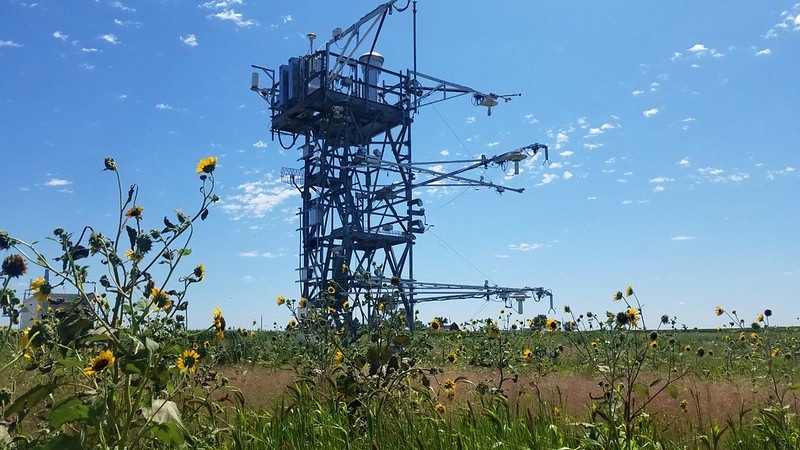

The project links NCAR’s modeling capabilities with NEON’s measurement network through a cyberinfrastructure projects thats aims to drive scientific discovery and innovation at the confluence of the geosciences and biological sciences.

Using models can enhance the impact of ecological research. Regardless of whether you are a seasoned modeler or a novice, setting up and running models designed for large spatial scales can be challenging. The NCAR-NEON collaboration makes the process simple. 

We have developed new capabilities to easily run Community Land Model (CLM) simulations at NEON tower sites by setting up the appropriate model configurations, datasets, and initial conditions. With this new tool, CLM uses gap-filled meteorology from NEON tower sites, the dominant plant species is mapped to the appropriate model plant functional type (PFT), and soil characteristics used in the simulations are updated to match observations from NEON’s soil megapits. Gap-filled NEON tower flux data are also available for model evaluation. Additionally, all the commands to run the model are combined into a script that you can easily call from a single line of code. 

These new capabilities are packaged into a Docker container, CESM-Lab, so that you can run simulations on any computing system, including your laptop or the cloud. Within the CESM-Lab container, you will find tutorials that guide you through how to run a CLM simulation for a NEON tower of your choice and help you to access, process, and evaluate model simulations. 

Please note that this tool is currently in development and we are soliciting feedback from early adopters. Results should be used for exploratory purposes but not for publication-quality science. More detailed documentation will be provided in a forthcoming publication. 

This project is supported by the National Science Foundation Award Number 2039932 in partnership with the CISE, BIO, and GEO directorates

