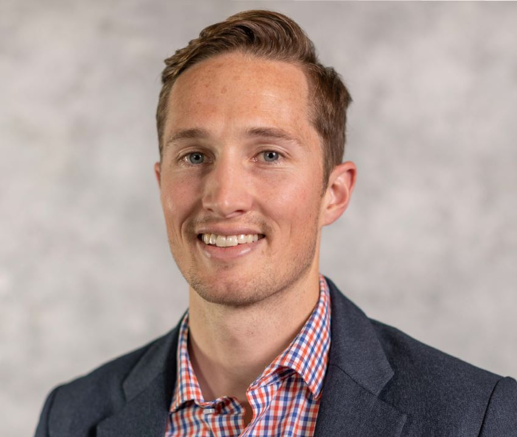

## Our Team

A number of reseachers have play a role in developing the workflow and datasets used for in this project. Here's a quick look at these contributors and their rolesin this project  s and analyses of NCAR models and NEON data. ioners, and people helping in a technical capacity. 

#### Negin Sobhani

!

Negin developed the NCAR workflow to run single point sites with NEON data and analize model results

#### David Durden

!

David worked to gap fill NEON data and provide input and evaluation data that are use for NCAR simulations.  

#### Jim Edwards

Jim built up the workflow for bringing NEON data products and using them in CLM simulations.

#### Dawn Lentz

Dawn handles data issue and data sharing for the prject.

#### Danica Lombardozzi

Danica has built the tutorial materials and visualization tools.  She also works with universitity partners on the project 

#### Mike SanClements

#### Brian Dobbins

Brian builds and maintains the containerized CESM-Lab that are used for this project 

#### Will Wieder

#### Samantha Weintraub-Leff

#### Gordon Bonan

#### Ed Aers

#### Valerio Pascucci

[Next: Our Partners](partners.html)

