## A Hurricane Scenario ##
Posted: Jan 2021
Author: Jonathan Vigh

The following scenario is provided as a thought exercise about what type of information people need to make critical decisions during a hurricane landfall event. 
This scenario is one that many coastal residents are quite familiar with. 

### Your situation ###

Imagine you live in a house in Melbourne Beach, a Florida community located on a barrier island about halfway up the east coast between Miami and Jacksonville. 
You are married and have a 1-year old baby and two dogs. You live in a typical one-story wood frame house about a quarter mile inland from the beach.
You have two cars and an emergency fund with $2000 in it, but your family is somewhat strapped for cash at the moment. 

### Tuesday ###

You turn on the news while eating breakfast and learn that a tropical storm is hitting the Leeward Islands and is forecast to approach your area in 5 days. You feel some concern and go to the National Hurricane Center (NHC) web page and see this:

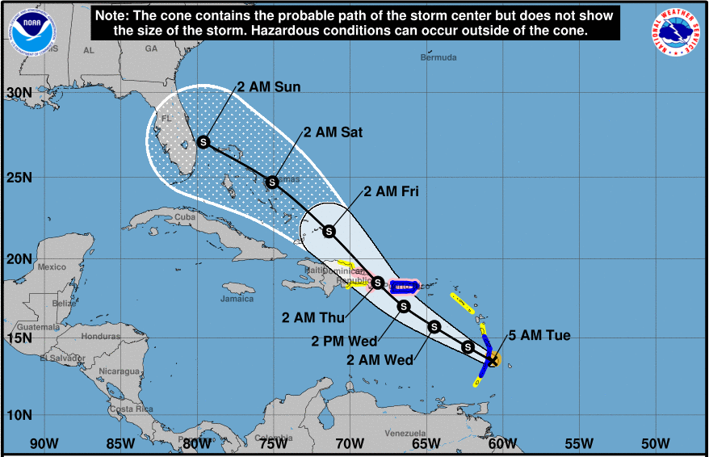

You aren't too concerned, but you mention it you partner that evening. 

### Wednesday ###

The next morning, the NHC graphic shows a similar track toward your area, but now the storm is forecast to be a hurricane offshore from your area about four days from now. Now you are starting to feel concerned and you keep a close eye on the local news site as you do some work. 

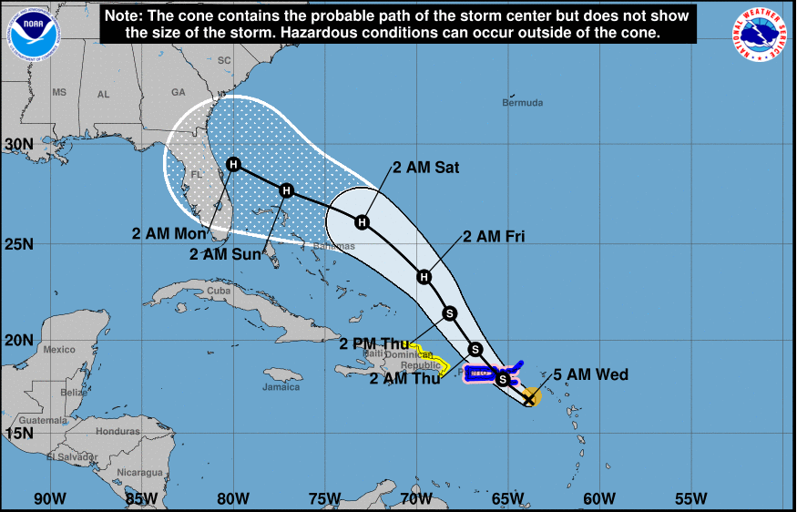

The media coverage is already extensive and there are reports about people flocking to stores to buy plywood, batteries, and bottled water. On the way home from work, you swing by the grocery store to pick up a few items to refresh your hurricane preparation kit, as well as some diapers and baby wipes. The bottled water is already sold out, but you're able to get some batteries and canned food. You check the NHC web site again in the evening and now you see this:

The threat now looks much more dire for you area, with a Major Hurricane predicted to make landfall in about 4 days. At supper, you start discussing with your family what your plan will be if the storm stays on track. Your partner is the adventurous type and wants to stay and ride it out, but you are more risk-averse and would not want to stay in your home during a major hurricane. You are too close to the water and could face a deadly storm surge. Besides, you are sure that the local authorities would put you under a mandatory evacuation order if the storm stays on track.    

### Thursday ###

The next morning, you wake up early to the sound of hammering and a circular saw. A neighbor down the street is cutting ploywood for shutters over his windows. You check the NHC web page, and the foecast graphic shows the dreaded 'M' right off the coast from Melbourne -- a Major Hurricane, with the track plowing straight into central Florida. 

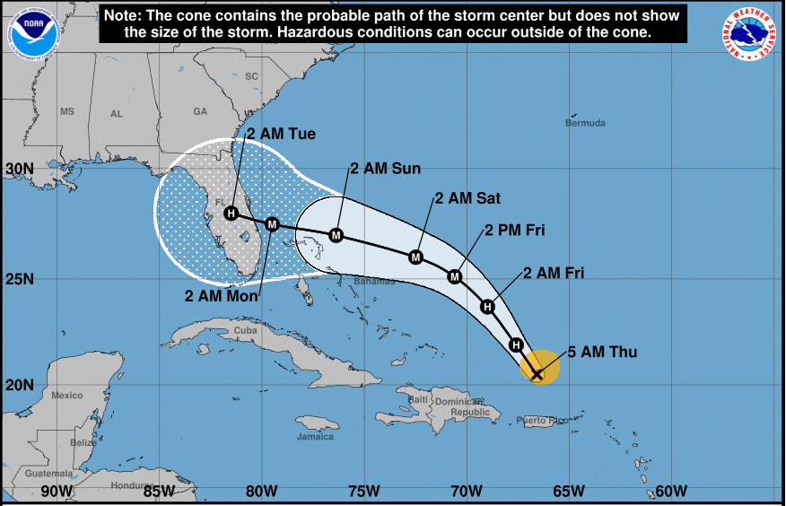

This is starting to feel like it could be "The Big One". You check your Twitter feed and see some weather enthusiasts posting scary screenshots of numerical model output of 145 mph winds over your area. You call your mom in Hilton Head, SC to see if it might be possible to stay with her if you and your family need to evacuate. She says "Sure, come on up!", but you know your partner will need some convincing. You have the type of storm shutters that require professional installation which would cost $500. You agonize over whether you should call to schedule the installers, wondering when it might be too late. That night, you and your partner have a heated discussion over whether or not your family should evacuate. The discussion ends in a draw -- no decision.

### Friday ###

You wake up the next morning and immediately check the NHC web page, now becoming a habit. Now you see this:

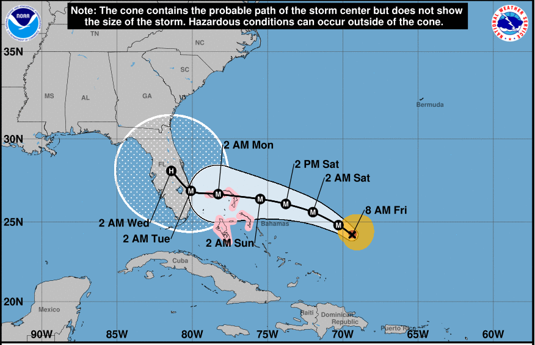

The storm has rapidly intensified, but the forecast track has slowed considerably. Now the hurricane is predicted to make landfall a little bit further south from your area, however the "cone of uncertainty" covers nearly all of Florida. Suprisingly, landfall still looks to be four days out. The NHC key message includes "Life-threatening storm surge and devastating hurricane-force winds are likely along portions of the Florida east coast by early next week, but it is too soon to determine where the highest storm
surge and winds will occur. Residents should have their hurricane plan in place, know if they are in a hurricane evacuation zone, and listen to advice given by local emergency officials." You think to yourself "someone is going to really get it, but they just don't know who yet".

The new track has you feeling a little relieved, but you know that if the storm follows the new track, you'll still be in line to get some serious affects. You also keep hearing the TV weathercaster saying not to focus on the exact track. You and your partner are the type of people who like to be prepared, so you have decided to put up your storm shutters. You call the company and book them to come out the next day to install the shutters. You and your partner also decide that if the storm stays on track, you will evacuate to your mom's house, probably leaving by mid-day Sunday.  

That evening, you see a blurb flash across the screen that the storm has been upgraded to a Category 4 hurricane. The rapid intensication that forecasters had been talking about for days has become a reality. Before going to bed, you check the latest forecast and now see that the storm is forecast to track nearly directly over your area, but then skirt up the coast directly toward Hilton Head. 

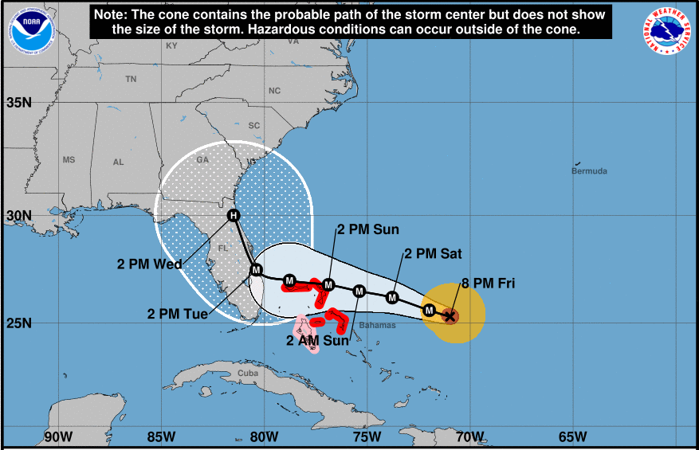

You scramble to think of other evacuation options. You see that you can get a hotel in Naples for $150/night or one in Tampa for $120/night. You make a reservation for the one in Tampa just to have this as an option. You have a really uneasy feeling about your situation, but you finally fall asleep. 

### Saturday ###

The next morning you immediately pull out your phone and look at the NHC webpage. You see the following:

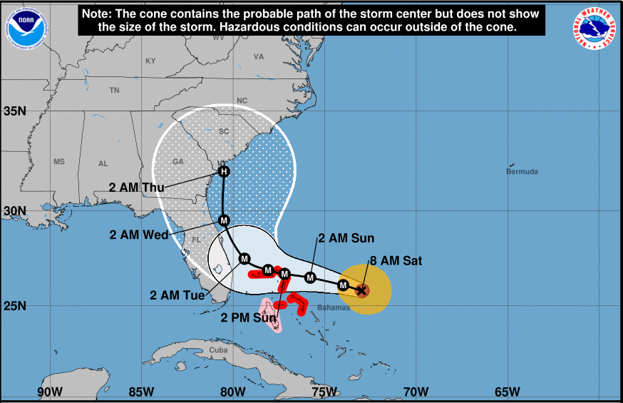

The track now shows the storm staying offshore, but probably coming close enough to bring some considerable wind and rain. You are surprised and immediately feel relieved. Now you aren't sure if you'll need them, but your partner reminds you that you're still well inside the cone of uncertainty. The installers show up right on time and begin installing the shutters. Within an hour, they are done.

As the day goes on, the forecast track continues to nudge further and further north.

### Sunday ###

After a good night's sleep, you wake up and check the NHC web page. You see the following:

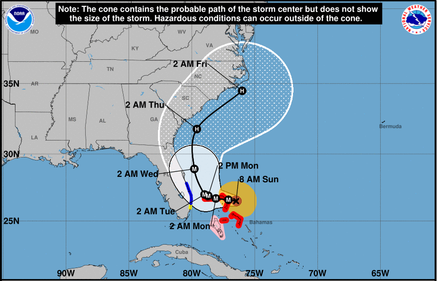

The forecast track is well offshore. You see the headline: "STRONGEST HURRICANE IN MODERN RECORDS FOR THE NORTHWESTERN BAHAMAS. ...CATASTROPHIC CONDITIONS OCCURING IN THE ABACOS ISLANDS...". Maximum sustained winds are an astonishing 180 mph. The hurricane has slowed to a crawl as it chews up the northern Bahamas. You decide to cancel your hotel reservations and then spend the rest of the day glued to the TV as harrowing reports come in from just a couple hundred miles away. By late afternoon, the skies have turned dark and there's a fresh wind blowing in from the Atlantic. You take the dogs down to the beach and see some enormous swells coming in.

### Monday ###

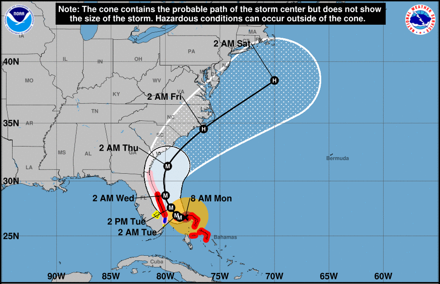

The storm is still stalled over the Bahamas. NHC has issued a tropical storm warning for your area. You warily eye the forecast showing the storm track nudging closer back toward Melbourne. You decide not to take your baby to daycare and you let your boss know you'll be working from home. At lunch-time, you go out into the yard and take the lawn furniture into the garage. It rains off and on during the afternoon and by evening, the wind is starting to pick up.  

### Tuesday ###

The next morning, you check NHC and see the following:

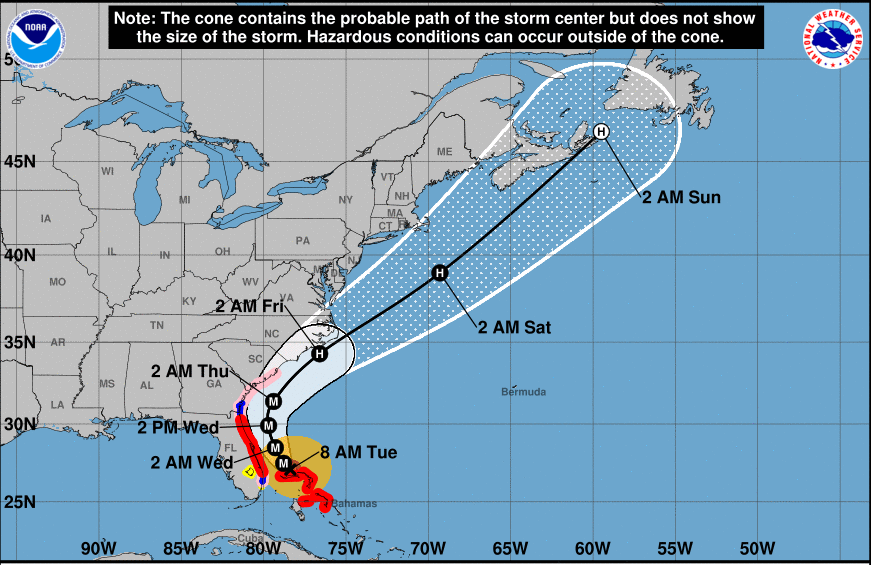

The storm has finally started to slowly move northward from the Bahamas. The track is now about 60 miles offshore from Melbourne and NHC has issued a hurricane warning for your area. You turn on the TV and see that local officials have issued a voluntary evacuation order for your area. Now you are pretty worried and wonder if you should have kept those hotel reservations. You check the National Weather Service site and see that wind gusts of up to 90 mph are possible. You are thankful that you ended up having your shutters put on, but you are a litle worried about your roof. Your house was built in 1975 and the roof hasn't been replaced for at least 20 years. You and your partner decide that you'll stay, but are ready to leave a moment's notice. You pack a suitcase with a few days worth of clothes, essential baby items, and your important documents.

That night, you can hear the rain hitting the shutters.

### Wednesday ###

After a not-so-great night of sleep, you check NHC and see the following:

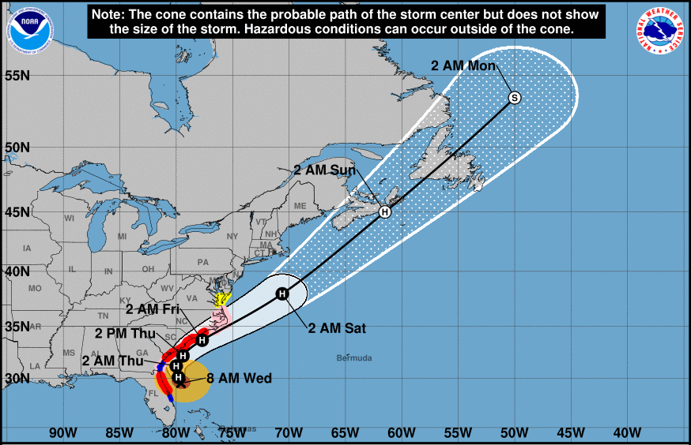

The storm has stayed offshore, but is not predicted to come much closer to your mom's place in Hilton Head. You give her a call and find out that they are recommending evacuation for her area. The local NWS gridpoint forecast shows wind gusts of 74 mph expected. She jokes about coming down to your place, but decides to go to a friends house in Columbia, about 150 miles inland. You are relieved to hear this.

Work and daycare is closed today, so you spend some quality time with your baby, peaking out the door from time to time. 

During the day, the wind kicks up as rain bands move in, some with drenching rain. But the highest winds are only about 45 to 50 mph. Your roof creaks once or twice in the strongest gusts, but your house is just fine. Cape Canaveral gets wind gusts close to 70 mph. In late afternoon, your power flickers a few times and then goes out. Because of your storm shutters, it is very dark in the house. You and your family eat some sandwiches and canned food by flashlight. The power finally comes back on later that night, which is a relief. 

### Thursday ###

The next morning, you check NHC and see this:

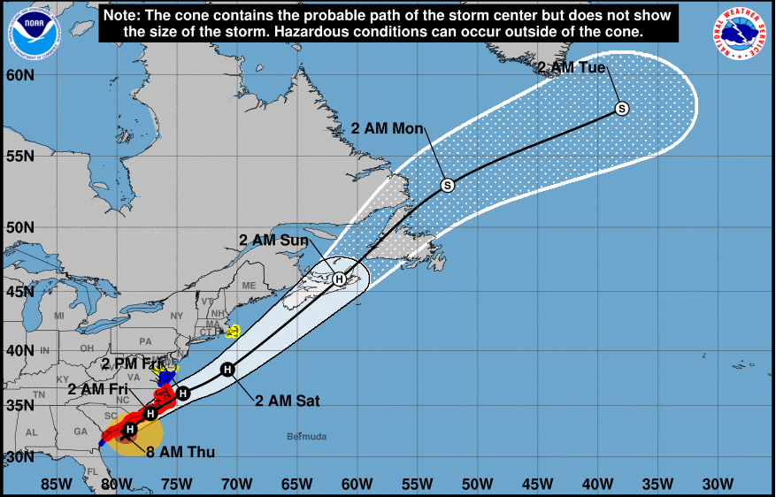

The storm is well on its way toward South Carolina. The wind is starting to die down and the air seems really clean. You call the company and schedule the storm shutters to be removed the next day. 

All in all, the storm ends up being much less of an impact than you have feared. You are grateful that it looks like your family has escaped this monster of a storm, but you feel bad for the people in the Bahamas. Your family is only out $500 for the storm shutter install and removal, but you did't have to evacuate and you only missed one day of work. 

## Discusion ##

A scenario like the above is quite typical for the majority of people who may initially be in the crosshairs at some point during the approach of a hurricane. Often, only a small portion of the population experience the strongest impacts of the hurricane. Most will get the fringes of the storm or may be missed entirely.

People always have to deal with uncertainty during the event. This uncertainty arises from the contantly changing forecast situation, but also depends on how resilient a person's home will be to storm impacts, how the power grid will be affected, and whether work will close or mandatory evacuation orders will be issued. While the available forecast products do a good job at conveying the track and possible intensity of the storm, it is often difficult for people to find accurate information about how high the winds will be at their specific location. People often seek information from a variety of sources including social media, but the accuracy or relevance of this information can be questionable (such as plots of raw model output). 

