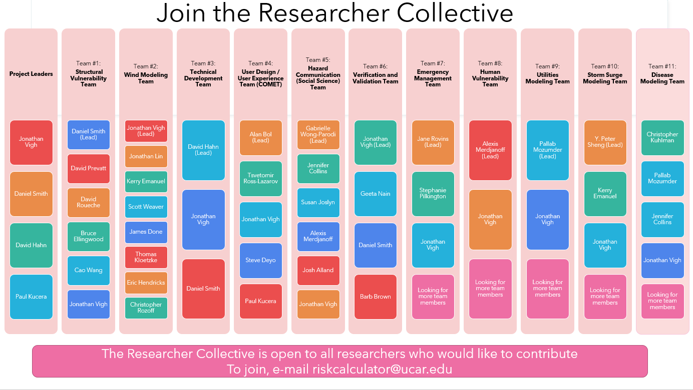

## Researcher Collective

A project of this scope is highly interdisiplinary, involving experts from the fields of meteorology, structural engineering, social science, psychology, emergency management, software engineering, user interface design, cloud engineering, and utilities modeling. To bring in the needed experience, we have formed a Researcher Collective by which interested experts in their respective disciplines can interact and provide input to the project. 

The collective  currently has 41 members organized into seven teams:
- Structural Vulnerability Team
- Wind Modeling Team
- Technical Develpoment Team
- User Design / User Experience Team (COMET)
- Hazard Communication Team (Social Science)
- Verification and Validation Team
- Emergency Management Team.

In addition, we are in the processing of forming at least six additional teams:
- Human Vulnerability Team
- Utilities Modeling Team
- Evacuation Risks Team
- Storm Surge Modeling Team
- Transportation Engineering Team
- Disease Modeling Team.

We invite interested researchers to join the Researcher Collective as we further develop the science behind the HurricaneRiskCalculator. Researchers in the Collective have access to collaboration tools, such as a project-wide Google Group (for e-mails) and a Shared Google Drive. The various teams have meetings as needed and in the future will collaborate on publications and funding proposals to advance their shared goals with the project. 

If you are a researcher or student interested in joining the Researcher Collective, please send us an e-mail: [riskcalculator@ucar.edu](mailto:riskcalculator@ucar.edu&subject=researcher%20collective). 

