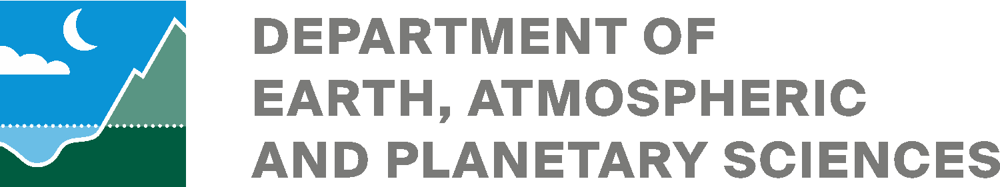
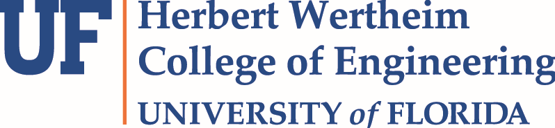
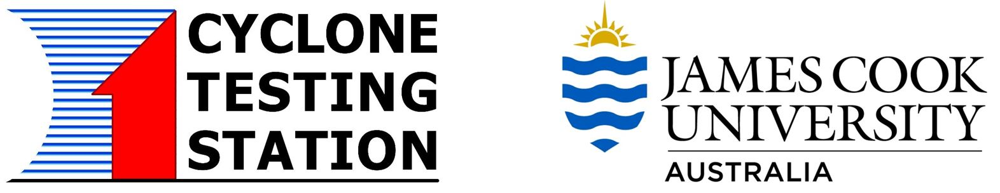
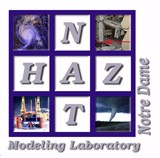

## Our Partners

### Funding Partners

This project is funded through generous support of the following sponsors:
- University Corporation for Atmospheric Research (UCAR) President's Strategic Initiative Fund FY2019 Research Award ($120,000)
- Research Applications Laboratory FY2017 Opportunity Fund ($29,241) and lab co-sponsorship ($13,000)
- The COMET Program co-sponsorship ($2,337)
- National Center for Atmospheric Research (NCAR) Early Career Faculty Innovator Program ($~$50,000) 

### Government Partners

Many government agencies as well as state and local governments have a strong interest in improving public safety. Several government agencies are partnering with us by having one of their staff or program directors serve as a point of contact either in our Researcher Collective or in our planned Advisory Board. When we have permission to list these agencies, we will do so.

### Universities Involved with this Project*

\*Being listed below does not inply a formal partnership. 

#### UCAR Member Universities 

A number of [UCAR member universities](https://www.ucar.edu/who-we-are/membership-governance/member-institutions) are represented by their experts who are participating in the project's Researcher Collective. 

| Colorado State University |  |

| Massachusetts Institute of Technology - [Department of Earth, Atmospheric, and Planteary Sciences](https://eapsweb.mit.edu/) |  |

| University of Florida |  | 

| University of Washington | |

#### UCAR International Affiliate Universities

Several [UCAR international affiliate universities](https://www.ucar.edu/who-we-are/membership/member-institutions/international-affiliates) are also represented by their experts who are participating in the project's Researcher Collective. 

| James Cook University - Cyclone Testing Station (Australia) |  |

| Monash University (Australia) |  |

#### Non-UCAR Universities

Several other non-UCAR member universities are also involved.  

| Auburn University |  | 

| Notre Dame University - [NatHaz Modeling Laboratory](https://nathaz.nd.edu/) |  |

| University of South Florida |  |

[Next: Project Schedule](schedule.html)

