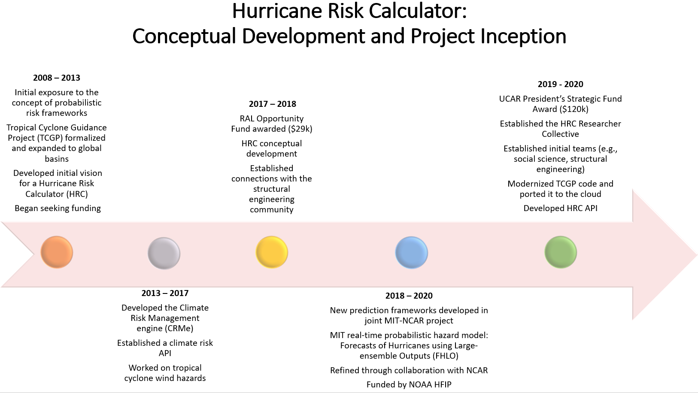
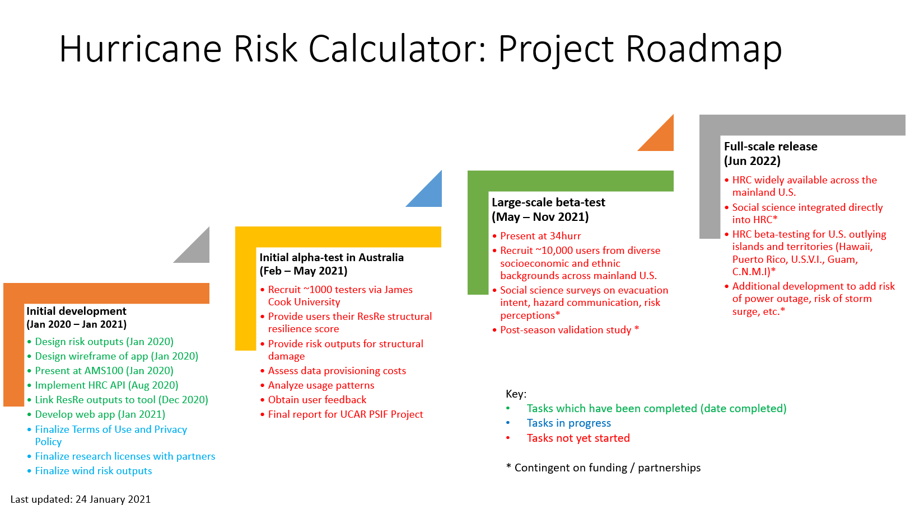

## Project Inception and History

Copyright Notice and Disclaimer. The software incorporated herein is Forecasts of Hurricanes using Large-ensemble Output (“FHLO”), version 1.3, © MIT used with permission. All Rights Reserved.

## Project Roadmap

[Next: Project Updates](updates.html)
