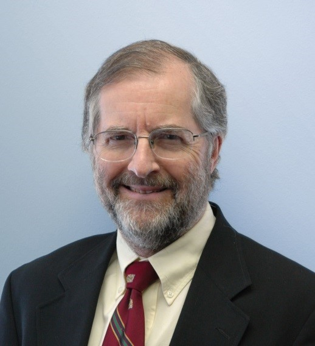
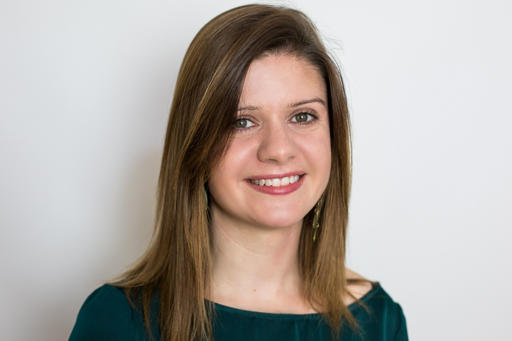
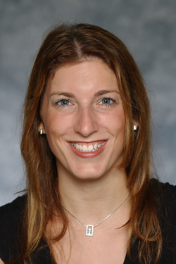
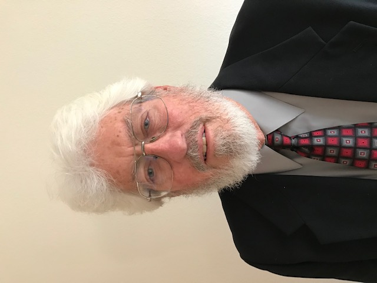

## Our Team

The HurricaneRiskCalculator project team is organized as a Researcher Collective. As of 25 October 2021, the collective includes 43 researchers, practioners, and people helping in a technical capacity. 

### Project Lead and Principal Investigator

#### Jonathan Vigh

[Dr. Jonathan Vigh](https://staff.ral.ucar.edu/jvigh/) (Project Scientist I, Research Applications Laboratory at the National Center for Atmospheric Research) works at the intersection of atmospheric science, data science, and weather/climate risk. Dr. Vigh has expertise in tropical meteorology and tropical cyclone dynamics. Dr. Vigh has studied the problem of eye formation in hurricanes to learn how the eye/eyewall structure impacts the subsequent intensification of the storm. Dr. Vigh has also done extensive work to construct [aircraft-based data sets](https://verif.rap.ucar.edu/tcdata/flight/) and a [historical database](https://verif.rap.ucar.edu/tcdata/historical/) to further investigate structure and intensity changes in tropical cyclones, with a particular focus on the radius of maximum winds (RMW). Dr. Vigh is the lead developer of the [Tropical Cyclone Guidance Project (TCGP)](http://hurricanes.ral.ucar.edu/) and the [Climate Risk Management engine (CRMe)](https://verif.rap.ucar.edu/jntweb/crme/). Dr. Vigh is the Principal Investigator of the HurricaneRiskCalculator project, leads the Wind Modeling and Verification and Validation teams. 

### Project Co-Principal Investigators

#### Daniel Smith

Dr. Daniel Smith has a PhD in Structural Engineering and is an Adjunct Professor with the Cyclone Testing Station at James Cook University in Australia. Dr. Smith is also a consultant faculty member at the University of Florida and a research fellow of the Capacity Center for Climate and Weather Extremes (C3WE) located at the National Center for Atmospheric Research (NCAR) in Boulder, CO. His current work throughout the US, Australia and the South Pacific covers a wide range of topics including: structural engineering for natural hazards, post-event damage assessment, mobile weather station deployment in extreme wind events, mitigation for wind and water related damages, behavioural aspects of community preparedness and insurance loss analysis. Dr. Smith has authored 40+ technical publications/reports and given 50+ presentations/seminars related to tropical cyclone risk and vulnerability. Dr. Smith leads the Structural Vulnerability Team.

#### David Hahn

David Hahn leads the Technical Development Team.

#### Paul Kucera

Dr. Kucera is an Assistant Director of the COMET Program at the University Corporation for Atmospheric Research (UCAR) and leads the international capacity development program. He has over 30 years of research and weather application development experience in the field of hydrometeorology.  His technical expertise is in weather radar, development of weather observation systems, tropical meteorology, satellite meteorology, numerical weather prediction, and international program development for the modernization of hydrometeorological services.  He has led or participated in projects in Africa, Middle East, Southeast Asia, Pacific Islands, Central America, South America, and North America.  His recent and current projects include modernizing the weather services through numerical weather prediction, tropical cyclone diagnostic evaluation development, impact-based forecasting, observational network development, training, and developing low cost, reliable observation networks.

### Project Collaborators and Advisors

#### Ahsan Kareem

Ahsan Kareem is the Robert M. Moran Professor of Engineering in the Department of Civil & Environmental Engineering and Earth Sciences (CEEES) at the University of Notre Dame. He is the Director of the Nathaz Modeling Laboratory at the University of Notre Dame. The focus of his work is on quantifying load effects caused by various natural hazards on structures and developing innovative strategies to manage and mitigate their effects. The characterization and formulation of dynamic load effects due to wind, waves and earthquakes on tall buildings, long-span bridges, offshore structures and other structures is carried out via fundamental analytical computational methods, and experiments at laboratory, and full-scale. He directs NatHaz Group (NatHaz Modeling Laboratory) which focuses on developments in cyberspace virtual collaborative research platforms, e.g.,  virtual organizations, crowdsourcing, computational intelligence, living laboratories, sensing and actuation, citizen sensing, web-enabled analysis and design, scientific machine learning (SciML) and cloud-based computing to enhance our ability to understand hazards and mitigating their effects. 

#### Alan Bol

Dr. Alan Bol leads the User Design / User Experience Team. Alan works with the COMET Program at UCAR Community Programs. With a background in education and Earth sciences, Alan has been creating online training for weather forecasters for over 20 years. 

#### Alexis Merdjanoff

#### Barbara Brown

Barbara G. Brown is a Senior Research Associate in the Joint Numerical Testbed Program (JNTP) in the Research Applications Laboratory of the National Center for Atmospheric Research and is a past Director of the JNTP.  Her research interests include weather and climate applications of statistics, including forecast evaluation and development of advanced user-focused verification approaches; measuring user needs and forecast value; probability forecasts and forecast uncertainty; statistical forecasting methods; and weather and climate extremes. She is past chair, and former member, of the World Meteorological Organization's Joint Working Group on Forecast Verification Research and is a recognized international expert on the development and application of methods to evaluate forecasts and models. Barbara has served on several advisory committees, including an NRC committee on uncertainty in weather and climate forecasts.  She is a Fellow of the American Meteorological Society (AMS) and former Chair of the AMS Committee on Probability and Statistics.  Barbara has a B.S. degree in statistics from Colorado State University and M.S. degrees in environmental sciences and statistics from the University of Virginia and Oregon State University, respectively. Barbara is lending her expertise to the project's Verification and Validation Team.

#### Bruce Ellingwood

Dr. Ellingwood is College of Engineering Eminent Scholar at Colorado State University.  His professional career of nearly five decades has included research and administrative positions at the National Bureau of Standards (now the National Institute of Standards and Technology), Johns Hopkins University, Georgia  Institute of Technology and Colorado State University.  His research and professional interests center on the application of probability and statistics to structural engineering, structural reliability assessment, natural and man-made hazards and risk-informed decision-making. He is internationally recognized as an authority on structural load modeling, reliability and risk analysis of engineered facilities, and as the leader in the technical development and implementation of probability based codified design standards for building structures.  He is former Editor of Structural Safety, the leading international journal in that field, and serves on several other editorial boards.  He is a member of the U.S. National Academy of Engineering, a Distinguished Member of ASCE, a Fellow of the Structural Engineering Institute, and a Registered Professional Engineer.

#### Cao Wang

####  Christian Mario Appendini Albrechtsen

Dr. Christian Mario Appendini Albrechtsen is a professor at the Universidad Nacional Autónoma de México, Instituto de Ingeniería, Laboratorio de Ingenieria y Procesos Costeros (Laboratory of Engineering and Coastal Processes). Dr. Appendini has expertise in wave modeling and coastal transport. Among other things, his research involves modeling waves from tropical cyclones under climate change to set appropriate design criteria for offshore structures such as oil rigs and wind turbines. Dr. Appendini will be a key point of contact for expanding and adapting the HurricaneRiskCalculator for Mexico.

#### Christopher Rozoff

Dr. Christopher Rozoff (Project Scientist, Research Applications Laboratory at the National Center for Atmospheric Research) conducts research on global, mesoscale, and tropical cyclone forecasting methods and validation and also works with mesoscale and LES modeling, machine learning methods, and remote sensing applications.

#### David Prevatt

#### David Roueche

#### Elisabeth Holland

#### Eric Hendricks

Dr. Eric Hendricks is a project scientist at the Research Applications Laboratory of the National Center for Atmospheric Research. He has a B.S.E. degree from the University of Michigan in Mechanical Engineering and M.S./Ph.D. degrees in Atmospheric Science from Colorado State University. Dr. Hendricks has expertise in tropical cyclones, tropical meteorology, numerical weather prediction (focus on mesoscale and large-eddy-simulation modeling), numerical methods, atmospheric dynamics, boundary-layer meteorology, and urban meteorology. Dr. Hendricks has authored or co-authored over 40 refereed publications and 100 conference presentations. Dr. Hendricks plans to contribute to wind hazard modeling in urban environments to support the HurricaneRiskCalculator.

#### Fernando Tormas-Aponte

Dr. Fernando Tormos-Aponte is Assistant Professor of Public Policy and Political Science at the University of Maryland - Baltimore County, with specializations in social movements, the politics of social groups, and social change. Dr. Tormos-Aponte has recently been selected to be a Faculty Innovator in the NCAR Early Career Faculty Innovator Program. His project will focus on vulnerability related to tropical cyclone-related power outages and equitable strategies for power restoration. He will be a key collaborator in adapting HurricaneRiskCalculator for Puerto Rico.

#### Gabrielle Wong-Parodi

#### Geeta Nain

#### Helen Greatrix

Dr. Helen Greatrex is an Assistant Professor in Geography and Statistics at the Pennsylvania State University and a co-hire of the Institute for Computational and Data Sciences. Her research focuses on taking a mixed methods approach to weather vulnerability modelling, along with assessing how remotely sensed weather products can support the weather risk management industry. She is also a member of the WMO Social and Economic Applications Working Group (SERA). Dr. Greatrex will be participating in the Social Science Team. 

#### James Done

#### Jane Rovins

#### Josh Alland

#### Jennifer Collins

Dr. Jennifer Collins (Professor, University of South Florida, School of Geosciences) works at the intersection of geography and climatology and also does research in the physical and social sciences. As a hurricane researcher, she investigates interannual and intraseasonal variability of hurricane activity. In the social sciences, she has extensive experience in hurricane evacuation studies. Dr. Collins will be participating on the Social Science Team.

#### Jonathan Lin

#### Kerry Emanuel

#### Laura Myers

Dr. Laura Myers is a Senior Research Scientist and Director of the Center for Advanced Public Safety. Dr. Myers joined The University of Alabama and the Center for Advanced Public Safety in 2013 having previously served as research faculty at Mississippi State University, Clemson University and Sam Houston State University. She has extensive experience in emergency management and criminal justice research. Dr. Myers will be participating in the Social Science Team. 

#### Liang Hu

#### Melissa Moulton

Dr. Melissa Moulton is a Project Scientist in the Oceanography Section of the Climate and Global Dynamics Division. She received a Ph.D. in Physical Oceanography in the MIT-WHOI Joint Program in 2016. Using coupled hydrologic and ocean models and field observations, Moulton is investigating the dispersal of contaminants and freshwater during extreme flooding events under changing climate and land use. Other interests include surface waves, nearshore processes, extreme events reconnaissance, cross-shelf exchange, larval transport, coastal water quality, and coupled human-natural systems.

#### Michael (Mike) Baldwin

Dr. Michael Baldwin is Associate Professor at the Department of Earth, Atmospheric, and Planetary Sciences, Purdue University. He has a B.S.E. degree in Atmospheric Science from the University of Michigan and a MSci and PhD degrees in Meteorology from the University of Oklahoma. He has research interests in numerical weather prediction, forecast verification, data assimilation, data mining. Dr. Baldwin has extensive experience in verification and joins the Verification Team of the Researcher Collective. His graduate student, Geeta Nain, is undertaking verification of the probabilistic forecasts of pointwise wind speed. 

#### Pallab Mozumder

#### Rick Luettich

Dr. Rick Luettich has an undergraduate and master’s degree in civil engineering from Georgia Tech and a doctor of science in civil engineering from MIT. He serves as the Director of UNC’s Institute of Marine Science, which is comprised of approximately 75 residential faculty, staff and students located on the coast in Morehead City, North Carolina. He also serves as the Director of the UNC Center for Natural Hazards Resilience and is the lead-PI on the Department of Homeland Security Coastal Resilience Center of Excellence and on the US Integrated Coastal Ocean Observing Systems (IOOS)Coastal and Ocean Modeling Testbed. He is one of the principal developers of the ADCIRC coastal circulation and storm surge model and has overseen applications ranging from interdisciplinary studies of physically mediated migration, larval dispersal and water quality, to coastal hazard delineation to hindcasts and forecasts of tides and storm surge/inundation along the US coast. ADCIRC has been a cornerstone of US Army Corps of Engineers and FEMA storm surge studies that include forensic studies in the aftermath of Hurricanes Katrina and Rita, planning studies for new hurricane protection systems for the Northern Gulf of Mexico coastline and coastal flood risk studies along the Gulf of Mexico and US East Coast for the FEMA National Flood Insurance Program. It is also being used in pilot storm surge forecasting projects. Luettich has served on three recent National Academy/National Research Council committees – one reviewing the factors that led to the catastrophic damage to New Orleans by Hurricane Katrina, the second reviewing the options for a new hurricane protection system for Southern Louisiana and chairing a third committee on Reducing Coastal Risk. He has also actively participated on numerous other advisory committees / governing bodies including the Southeast Louisiana Flood Protection Authority-East; the Science and Engineering Advisory Council for the Water Institute of the Gulf; and as a publicly elected member of the Carteret County Board of Education. He joins the Researcher Collective’s newly formed Storm Surge Team.

#### Robert (Bob) Goldhammer

Mr. Robert Goldhammer has been involved in Emergency Management since the early 1990s, serving in the Tampa Bay area as Assistant Chief of Operations with Hillsborough County Emergency Medical Service and as the EMA Director for Polk County, Iowa. He has degrees in Meteorology (B.S., 1974), Business Management (B.S., University of South Florida, 1995), and Teachers in Geosciences (Masters, Mississippi State University, 2002). He received his Certification as an Emergency Manager (CEM) from the International Association of Emergency Managers (1994) and Certified Business Continuity Professional (CBCP) certification from the Disaster Recovery Institute International (1999). Bob served as a regional president of the International Association of Emergency Managers for approximately 10 years. He currently represents the organization as liaison to the National Weather Service (NWS) Weather Ready Nation program and the World Meteorological Organization’s global Weather Ready Nations program. He is a member of the FEMA National Reservist Program where he serves with the Hurricane Liaison Team. He was the co-chair of the American Meteorological Society (AMS) Emergency Management Committee from its inception to January 2017. He is currently a member of the instructor cadre for the National Disaster Preparedness Training Center, is a member of the HiWeather Communications workgroup, and is also a member of an ASCE-NWS workgroup that is updating the EF Tornado Intensity Scale based on engineering studies of buildings and other structures impacted by high winds. He will be participating in the project’s Emergency Management team to build connections between this effort and the Emergency Management community. 

#### Scott Weaver

#### Stephanie Pilkington

#### Susan Joslyn

#### Taylor Asher

Mr. Taylor Asher is a PhD student at the Coastal Circulation and Hazards Research Group located at the Institute of Marine Sciences (IMS), an off-campus research unit of the University of North Carolina at Chapel Hill that is located on the central North Carolina coast. This group, led by Dr. Rick Luettich, is actively involved in modeling and observational studies of physically driven processes in coastal / estuarine waters and in the hazards that result when coastal / estuarine waters respond to severe weather events. Taylor has developed a computationally fast approach to probabilistic prediction of storm surge using surrogates of the ADCIRC coastal circulation and storm surge model. He joins the Researcher Collective’s newly formed Storm Surge Team.

#### Thomas Kloetzke

#### Tsvetomir Ross-Lazarov

#### Y. Peter Sheng

[Next: Our Partners](partners.html)

