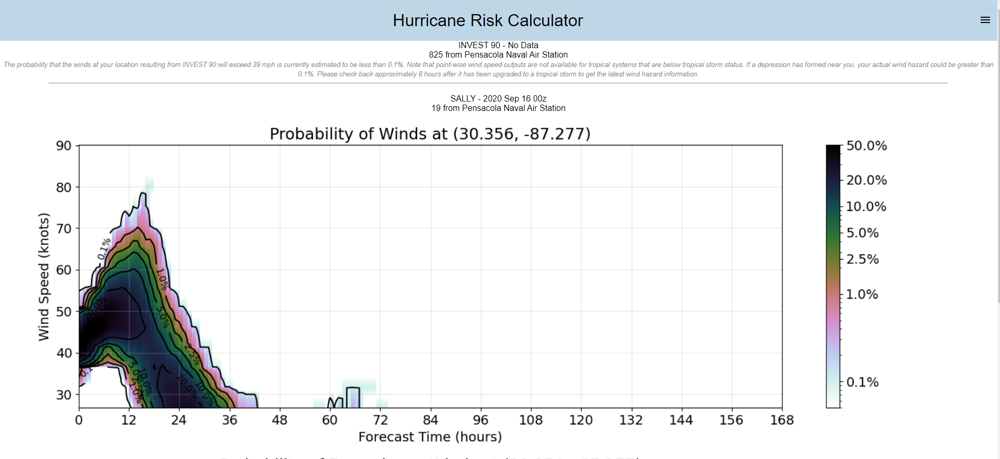
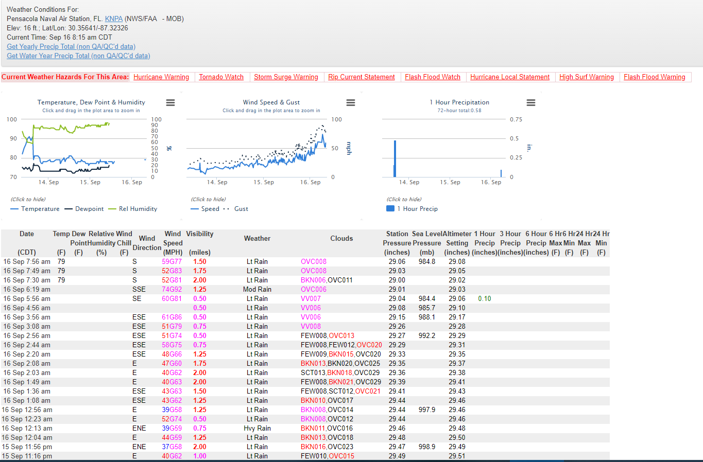
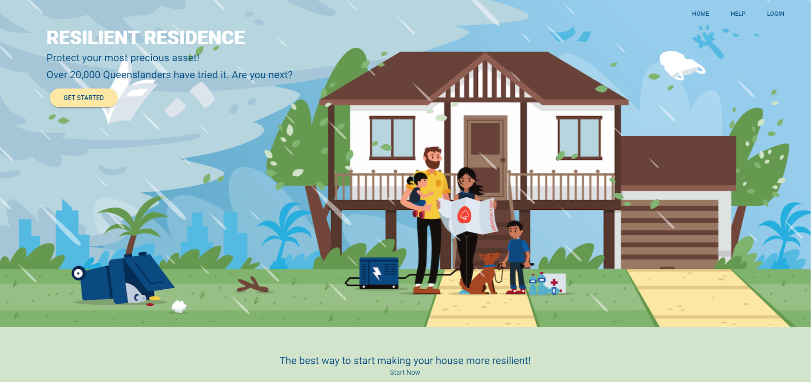
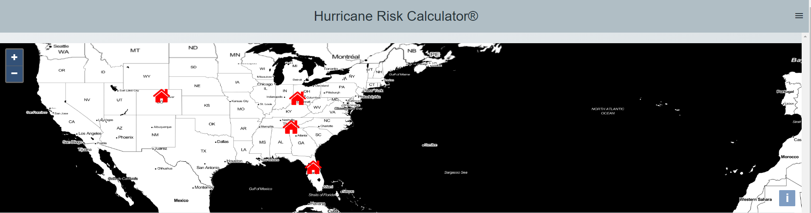

## Project Updates ##

### 16 September 2020 ###

We have added the capability to retrieve pointwise wind output into the web app, based on output from the Forecasts of Hurricanes using Large-ensemble Outputs (FHLO). 

Copyright Notice and Disclaimer. The software incorporated herein is Forecasts of Hurricanes using Large-ensemble Output (“FHLO”), version 1.3, © MIT used with permission. All Rights Reserved.

The first wind hazard retrieval, shown below, was made for Pensacola Naval Air Station, which was in the process of being impacted by Hurricane Sally. The upper panel of the plot shows the probability density function (PDF) in time -- essentially, the likelihood that maximum sustained winds (1-min average) would exceed various wind speed thresholds at each time in the 5-day forecast. The bottom panel shows the cumulative density function (CDF) -- the total likelihood that sustained winds at the site would exceed given thresholds. 

FHLO predicted a ~5% chance that this location would experience sustained winds of hurricane-force (74 mph). It turned out that the Pensacola Naval Air Station did in fact record sustained winds of 74 mph and a gust to 92 mph. 

To our knowledge, this is the first-of-its kind capability for any web site.

### 15 December 2020 ###

We have finished work to integrate ReselientResidence (ResRe)'s structural vulnerability information into the web app. Once a user has signed up, they can now go to the home page, click the ResRe image, and be sent to ResRe's questionnaire. ResRe uses this information to calculate the user's cyclone resilience score and then sends this back to the web app where it is stored in a database. This key development opens the door to providing personalized risk outputs to users in the near future. 

### 08 January 2021 ###

We have added multiple address capability into the web app. 

Previously, the app could only store one address at a time and the ResRe cyclone resilience score was tied directly to the user's id. 
Now, the app will let a user define up to 10 separate addresses and fill out a ResRe vulnerable profile for each location. 
The ResRe resilience score is now tied to the property id itself. This important change allows users to get pointwise wind hazard outputs for multiple locations without having to change their address. This will eventually support new capabilities to allow users to share their risk outputs with each other.

### 25 January 2021 ###

We have updated the web app to comply with the General Data Protection Regulation (GDPR) required by the European Union. 
This includes allowing a user to delete their account and all personal information (e.g., email, address). The web app retains a record that the user's information has been deleted to comply with GDPR.
