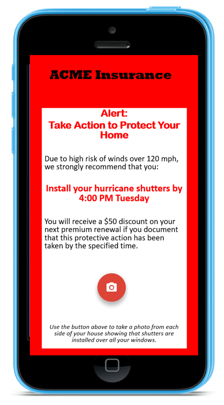

## Become a Commercial Partner

We have developed a highly-scalable cloud-based data and content delivery infrastructure capable of delivering the risk outputs of the HurricaneRiskCalculator&reg; for a variety of mobile applications. By using serverless cloud methods, we aim to keep the costs of content delivery as low as possible. The outputs of the risk calculator are exposed through an API and can be made available for licensing at a very reasonable rate per user or per call. We can also offer licensing for the entire end-to-end risk framework for companies who wish to adapt it for their clients and specific business purposes. 

A key aspect of the framework is to offer alerting capabilities so that app users can be notified when their risk level has increased, or when specific protective actions are recommended (e.g., put up storm shutters). 

We invite companies to partner with us as we refine, optimize, and customize the HurricaneRiskCalculator&reg; for a variety of mobile phone and web apps such as general-interest weather apps, apps for public safety, apps for emergency managers, and consumer-facing insurance apps.  

If your company is interested in partnering with us, please send us an e-mail: [riskcalculator@ucar.edu](mailto:riskcalculator@ucar.edu&subject=commercial%20partnership). 
